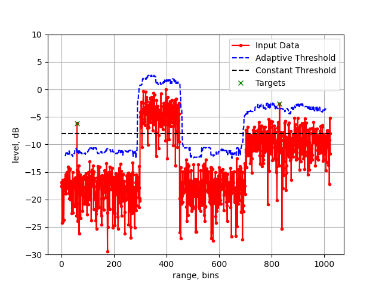

# <div align="center">Ordered-Statistic CFAR mathematical modelling and HLS implementation</div>


<div align="right"> <i>PhD, Senior R&D Engineer </i></div>
<div align="right"> <i>Aleksei Rostov </i></div>
<div align="right"> <i>Munich, 2022</i> </div>

## Agenda

- [Theory](#theory)
- [Mathematical Modelling](#mathematical-modelling)
- [High Level Synthesis Implementation](#high-level-synthesis-implementation)
- [References](#references)
	
	
	
<br/>

	
## Theory

<p align="justify">
Constant False Alarm Rate or CFAR is used in radar signal processing for adaptive thresholding with predetermined constant probability of false alarm [1]. Radar detectors 
based on CFAR are implemented in many RADAR processing chains. The main idea of adaptive thresholding - is to detect targets in case of noise floor 
or Signal-To-Noise Ratio changing (Fig. 1.1).

<p align="center">
  
</p>

<div align="center">
<b>Figure 1.1 </b> Simulation of constant and adaptive thresholding
</div>
<br/> 

<p align="justify">
The generic structure of CFAR detector is depicted on Fig. 1.2. There are two sliding windows with reference and 
guard (may be ommited) cells, the Cell-Under-Test between, 
processor with Linear or Nonlinear operation and multiplier with comparator. 
Adaptive Threshold for comparator depends on value <i>Z</i> (calculated 
by processor unit) and coefficient  $\Alpha$  (determined by desired probability of false alarm).


<p align="center">
  
</p>

<div align="center">
<b>Figure 1.2 </b> Generic structure of CFAR detector
</div>
<br/> 


<p align="justify">
The comparator compares Cell-Under-Test and Threshold after the processor unit. The processor unit can implement different 
algorithms for calculation Threshold. Here is considered only nonlinear Ordered-Statistic algorithms (OS CFAR). 
The principle of OS CFAR is very simple: all samples from the sliding windows are sorted in ascending order and then <i>k-th</i> sample (<i>order statistic</i>) is choosen for calculating Threshold. 
Thus OS-CFAR implementation is based on simple <i>sorting</i> algorithm and sliding window.


<i>TODO</i> add information about calculation parameters for CFAR (order, scaling coeficient)


## Mathematical Modelling


<p align="justify">
Mathematical modelling of CFAR allows to figure out <i>hardware design</i> of the algorithm and proof outputs during HLS Co-Simulation. 
For mathematical modelling two Python scripts were created: <i>cfar_generator.py</i> and <i>cfar_model.py</i>.
First script generates a synthetic input for HLS testbench and header <i>parameters.h</i> file for initialization of HLS CFAR implementation. 
The synthetic input is scaled to unsigned 16-bits value (from 0 to 65536) and consists of 2 peaks (targets) with several 
SNR zones (Fig. 1.1).

```sh
python3 cfar_generator.py --h

Input signal size and CFAR parameters

positional arguments:
  NPOINTS     Number of points
  REFWIND     Number of cells in CFAR window
  PFA         Probability of false alarm

python3 cfar_generator.py 1024 40 1e-2
```

what means - the synthetic signal consist of 1024 samples and CFAR parameters: window size is 32 and 28 sample is choosen as <i>k-th</i> for calculating Threshold. 
The script will generate several files:

```sh
cfarIn_float.txt
cfarIn_u16.txt
cfarPy_param.txt
parameters.h
```

<p align="justify">
<i>cfarIn_float.txt</i> and <i>cfarIn_u16.txt</i> files is float and unsigned 16-bits representation of input data. 

The <i>cfar_model.py</i> consists of mathematical model of OS CFAR and test of the model by using data from <i>cfar_generator.py</i>. 
The model is implemented in <i>cfar_1d(s, GrdHalf, RefHalf, T, k_th, Type)</i> and <i>sort_insertion(x)</i> functions
<br>

<details>

<summary><b>View code</b></summary>

```python
def cfar_1d(s, GrdHalf, RefHalf, T, k_th, Type):
    """CFAR for one-dimentional array.

    Args:
    s (numpy.ndarray)	: Input array.
            GrdHalf(int): Half of guard window.
            RefHalf(int): Half of reference window.
                T(float): Scaling factor for thresholding.
               k_th(int): cell for ordered-statistic
            Type(String): OS - ordered statistic
                          CA - cell-averaging
                          GO - greatest-of
                          SO - smallest-of

    Returns:
        s_cfar(numpy.ndarray): output array of thresholding.
        t_cfar(numpy.ndarray): output array of detection.
    """
    if s.ndim > 1:
        print('numpy.ndarray error')
        return -1
    N 			= np.size(s)
    s_cfar 		= np.empty(N)
    t_cfar 		= np.zeros(N)
    s_cfar[:] 	= np.nan 
    ref_win 	= np.zeros(2*RefHalf)
    
    for idx in range(GrdHalf+RefHalf, N-(GrdHalf+RefHalf)):
        ref_win[0:RefHalf] = s[idx-(GrdHalf + RefHalf):idx-GrdHalf]
        ref_win[RefHalf :] = s[idx+ GrdHalf + 1: idx + GrdHalf + RefHalf + 1]
        ref_win 	= sort_insertion(ref_win)
        Z 			= T*ref_win[k_th]
            
        s_cfar[idx + 0] = Z
        t_cfar[idx + 1] = comp_geb(Z, s[idx + 1])
    return s_cfar, t_cfar
```

</details>


<br>

<p align="justify">
The <i>sort_insertion(x)</i> function implements sorting algorithm by using Insertion sort algorithm [2] 
which is good for FPGA implementation by using network based on Systolic Array [3].

<br>

<details>

<summary><b>View code</b></summary>

```python

def PE(din, staticVar, k):
    """
    Processing Element - part of systolic array
    @param uint32_t din: new input 
    @param uint32_t staticVar: array for static var
    @param uint32_t k: index
    @return dout uint32_t
    """   
    if din > staticVar[k]: # 
        dout = staticVar[k] # 
        staticVar[k] = din
    else:
        dout = din
    return dout


def sort_insertion(x):
    """
    Sorting network (insertion algorithm)
    @param uint32_t x: input array
    @return y uint32_t: output array
    """  
    # length of input array
    N = np.size(x)
    y = np.zeros(N)
    d = np.zeros(N)
    stVar = np.zeros(N)
    
    for k in range(2*N):
        if k < N:
            d[0] = PE(x[k], stVar, 0)
        else:
            d[0] = PE(MAX_VALUE, stVar, 0)

        for k_th in range(N-1):
            d[k_th + 1] = PE(d[k_th],   stVar, k_th + 1)

        if k > N - 1:
            y[k - N] = d[N-1]
            
    return y
	
```

</details>

<br>
<p align="justify">
OS CFAR model slides accross input data, sorts samples from sliding window, takes <i>k-th</i> sample and calculates Threshold based on predetermined meaning of constant probability of false alarm.

## High Level Synthesis Implementation

<br/>

## References

<br/>

1. Mark A. Richards - Fundamentals of RADAR Signal Processing - 2005
2. [Insertion sort Wiki] (https://en.wikipedia.org/wiki/Insertion_sort)
3. [Systolic array Wiki] (https://en.wikipedia.org/wiki/Systolic_array)
