# <div align="center">Fast Fourier Transform mathematical modelling and HLS implementation</div>


<div align="right"> <i>PhD, Senior R&D Engineer </i></div>
<div align="right"> <i>Aleksei Rostov </i></div>
<div align="right"> <i>Munich, 2022</i> </div>

## Agenda

- [Theory](#theory)
- [Mathematical Modelling](#mathematical-modelling)
- [High Level Synthesis Implementation](#high-level-synthesis-implementation)
- [References](#references)


## Theory
Discrete Fourier Transform (DFT) of a finite-length sequence of length *N* is

$$X[k]  =\sum_{n=0}^{N-1}x[n] W_{N}^{kn}, \qquad k = 0,1,...,N-1.\qquad (1.1)$$

where $W_{N}^{kn} = e^{-j(2\pi kn/N)}$.

Fast Fourier Transform (FFT)  is <i>exactly</i> the same DFT with optimization by reducing number of computations. 
Algorithm FFT <i>decimation-in-time</i> is based on decomposition the input sequence $x[n]$ into smaller subsequences. 
For example, Eq. (1.1) can be separated into even- and odd-numbered points


$$X[k]  =\sum_{n=0}^{(N/2)-1}x[2n] e^{-j(2\pi k2n/N)} + \sum_{n=0}^{(N/2)-1}x[2n+1] e^{-j(2\pi k(2n+1)/N)}, \qquad (1.2)$$

with substitution $e^{-j(2\pi k2n/N)} = e^{-j(2\pi kn/(N/2))}$ in the first sum and $e^{-j(2\pi k(2n+1)/N)} = e^{-j(2\pi k/N)}e^{-j(2\pi kn/(N/2))}$  in the second sum, we obtain


$$X[k]  =\sum_{n=0}^{(N/2)-1}x[2n] e^{-j(2\pi kn/(N/2))} + e^{-j(2\pi n/N)} \sum_{n=0}^{(N/2)-1}x[2n+1] e^{-j(2\pi kn/(N/2))}, \qquad (1.3)$$


or with $W_{N/2}^{kn} = e^{-j(2\pi kn/(N/2))}$ and $W_{N}^{k} = e^{-j(2\pi k/N)}$


$$X[k]  =\sum_{n=0}^{(N/2)-1}x[2n] W_{N/2}^{kn} + W_{N}^{k} \sum_{n=0}^{(N/2)-1}x[2n+1] W_{N/2}^{kn}. \qquad (1.4)$$

Both sums in Eq. (1.4) could be rewritten into 

$$X[k]  =G[k] + W_{N}^{k} H[k]. \qquad (1.5)$$

where $G[k]$ is $(N/2)$ - point DFT of the even sequence  $x[2n]$  in the first sum and $H[k]$ is $(N/2)$ - point DFT of the odd sequence  $x[2n+1]$  in the second sum.
Eq. (1.5) means, that for computation $X[k]$ it is necessary to calculate DFT of two subsequences - the even- and odd-numbered points of $x[n]$.  
Furthermore $G[k]$ and $H[k]$ $(N/2)$ - points DFT can be decomposed in   sum of two $(N/4)$ - points DFT, then in sum of two $(N/8)$ - point DFT and so on. 
When $N = 2$ we obtain 2-points DFT with $W_{N}^{k}$ coefficients

$$X[0]  =x[0] + W_{2}^{0} x[1]. \qquad (1.6)$$
$$X[1]  =x[0] + W_{2}^{1} x[1]. \qquad (1.7)$$

By using the fact that  $W_{N}^{N/2} =  W_{2}^{1} = e^{-j(2\pi/N)N/2}=-1$ and  $W_{2}^{0}  = e^{0}=1$, we obtain

$$X[0]  =x[0] + x[1]. \qquad (1.8)$$
$$X[1]  =x[0] -  x[1]. \qquad (1.9)$$

There is no multiplication for 2-points DFT computation. 
Since  two 2-points DFT yield 4-points DFT, 4-points DFT yield 8-points and so on, we decompose entire DFT into stages and sets of small DFT. 
For example for 8-point DFT flow graph will look like 

<p align="center">
  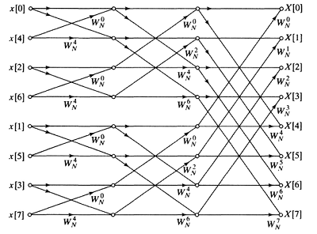
</p>

<div align="center">
<b>Figure 1.1 </b> Flow graph of decomposition and computation of 8-point DTF
</div>
<br/> 

<p align="justify">
This implementation requires number of multiplications and additions is equal to $N\log_2N$ , what is significantly less then for direct implementation of DFT $N^2$. 
The reduction extremely grows up with the increasing number of DFT points. 


All optimizations for improving the efficiency of the computation are based on the symmetry and periodicity properties of   $W_{N}^{kn}$ [1], specifically,

$$W_{N}^{k[N - n]} =W_{N}^{-kn} = (W_{N}^{kn})^* \qquad (symmetry ) \qquad (1.2)$$


$$W_{N}^{kn} =W_{N}^{k(n+N)} = W_{N}^{(k+N)n} \qquad (periodicity) \qquad (1.3)$$


<p align="justify">
By reducing number of $W_{N}^{kn}$ we may group corresponding pairs of $x[n]$  
samples with equal coefficients, that allow to decrease number of multiplications. 
Also coefficients transformation can be explained by Fig. (1.2)

<p align="center">
  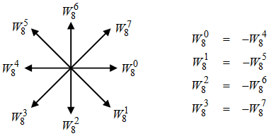
</p>

<div align="center">
<b>Figure 1.2 </b> Transformation of coefficients
</div>
<br/>

<p align="justify">
As seen from Fig. (1.2) , it is enough to compute and store only $N/2$ of coefficients. 
This is the main advantage of periodocity property of $W_{N}^{kn}$. 
FFT implementation consist of $\log_2N$ stages and $N/2$ butterflies for every stage. 
The butterfly is a unit of FFT that implemets 2-point DFT with  one  $W_{N}^{kn}$ coefficient  Fig. (1.3)

<p align="center">
  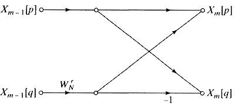
</p>

<div align="center">
<b>Figure 1.3 </b> Flow graph of basic butterfly computation
</div>
<br/> 

Associated equations for a butterfly from Fig. (1.3)

$$X_m[p] =X_{m-1}[p] + W_N^rX_{m-1}[q]  \qquad (1.4)$$
$$X_m[q] =X_{m-1}[p] - W_N^rX_{m-1}[q]  \qquad (1.5)$$

<p align="justify">
The batterfly requires only one complex multiplication $W_N^rX_{m-1}[q]$ and $N\log_2N$ multiplication for computing FFT overall. For example, 8-point FFT requires 24  complex multipliers as can be seen from Fig. (1.2).
Apart of butterfly calculation it is necessary to reoder input data for the first stage. 
Reordering involves <i>bit-reversal</i> algorithm, when every bit of input data index binary form is reversed. For example, indexes for  $N = 8$ will be reorder like

<p align="justify">

| Normal Index| Binary form of normal index |Binary form of reserved index|Reserved index|
| :-: | :-:| :-:| :-:|
| 0 | 000 | 000 | 0 |
| 1 | 001 | 100 | 4 |
| 2 | 010 | 010 | 2 |
| 3 | 011 | 110 | 6 |
| 4 | 100 | 001 | 1 |
| 5 | 101 | 101 | 5 |
| 6 | 110 | 011 | 3 |
| 7 | 111 | 111 | 7 |


Summarize the information above, FFT implementation requires (decimation-in-time Cooley–Tukey FFT algorithm):
1. butterfly for complex multiplication on every stage
2. set of complex coefficients
3. input signal reodering


<i>TODO</i>  Research: spectrum leaking, SNR and registers length limitation

<i>TODO</i>  Research: spectrum leaking, SNR and registers length limitation


<br/>

## Mathematical Modelling


<p align="justify">
Mathematical modelling of FFT allows to figure out <i>hardware design</i> of the algorithm and proof outputs during HLS Co-Simulation. 
<br>
For mathematical modelling two Python scripts were created: <i>signal_generator.py</i> and <i>fft_model.py</i>. 
First script generates a synthetic complex signal for HLS testbench and header <i>parameters.h</i> file for initialization of HLS FFT implementation. 
The script may be launching with, for example,the following arguments

```sh
python3 signal_generator.py 1024 3 40
```
what means - the synthetic signal consist of 1024 samples and is composed from 3 signals with Signal-To-Noise ratios 40 dB, 38 dB, 36 dB. 
Code for parsing the arguments is 

```sh
parser.add_argument('Npoints' ,default=None, type=int)
parser.add_argument('Nsignals',default=None, type=int)
parser.add_argument('SNR_dB'  ,default=None, type=int)
```

<p align="justify">
where <i>Npoints</i>  is a number of FFT points, 
<i>Nsignals</i> - is an amount of harmonics with random frequencies in the synthetic signal and <i>SNR_dB</i> - is a max value of Signal-To-Noise ratio of the first harmonic in the synthetic signal, SNR of other harmonics will be decreased on 2 dB for every one.
Mathematical model of the complex synthetic signal is

$$x_k[n] = 10^{(SNR_{dB}-2k)/20}e^{-j2\pi f_k n/Npoints} + n_k[n] \qquad (2.1)$$
<p align="justify">
where $n = 0 ... Npoints-1$ - signal's sample, $k = 0 ... Nsignals-1$ - harmonic's number, $n_k$ - random noise for every harmonic.
Frequency meaning $f_k$ of harmonic  is choosen randomly and a power is decreased for every harmonic on 2 dB.
<br>
After calculation in Eq. (2.1) the amplitude of synthetic sum signal is scaled to <i>-1 ... +1</i> and <i>-32768 ... +32768</i> and samples are saved to files.
<br>
The script will generate several files:

```sh
nonscaled_re.txt  
nonscaled_im.txt
scaled_re.txt
scaled_im.txt
parameters.h
```

<p align="justify">
Header <i>parameters.h</i> consist of FFT parameters and scaled to  <i>-32768 ... +32768</i> coefficients. The header file is used by HLS FFT implementation. 
Files <i>nonscaled_.txt</i> are complex float point input for Numpy FFT implementation, that will be used for comparison with HLS FFT implementation. 
Files <i>scaled_.txt</i> are scaled to 16-bit signed register complex input for HLS FFT.
<br>
<p align="justify">
The <i>fft_model.py</i> python script consists of scaled to 16-bits signed register implementation of FFT and FFT from Numpy package. 
The script reads out <i>scaled_.txt</i> and <i>nonscaled_.txt</i> data, output <i>cmpx_hls.txt</i> from HLS Co-simulation and plots results of three FFT. 
The mathematical model of FFT is based on decomposition DFT during computation (Fig. 1.1) and is implemented stage-by-stage with pre-computed coefficients.
<br>


<details>

<summary><b>View code</b></summary>

```python
def fft_dit(x, w):
    """
    FFT decimation-in-time implementation 
    @param  complex int16 x: input data
    @param  complex int16 w: twiddling coefficients
    @return complex int16 y: output data
    """
    Np = np.size(x)
    Ns = int(np.log2(Np))
    Y_int16 = np.zeros((Ns + 1, Np), dtype=complex)
    
    # reverse input
    for k in range(Np):
        Y_int16[0, k] = x[revBits(k, Ns)]
        
        
    for casc in range(Ns):
        d = 0
        for k in range(Np // 2):
            idx_w = int(np.mod(k, 2**casc))*2**(Ns - 1 - casc)
            if np.mod(k, 2**casc) == 0:
                d = 2*k
            idx_1 = d 
            idx_2 = d + 2**casc
            d = d + 1
            Y_int16[casc + 1, idx_1], Y_int16[casc + 1, idx_2] = butter_time_int16(Y_int16[casc, idx_1], Y_int16[casc, idx_2], w[idx_w])
   
    return np.round(Y_int16[Ns, :])


def butter_time_int16(x, y, w):
    """
    Radix 2 butterfly implementation (decimation-in-time) with rounding to int16 and scaling factor for output
    @param complex int16 x:  FFT complex point (sample)
    @param complex int16 y:  FFT complex point (sample)
    @param complex int16 w:  Complex coefficient
    @return x_t, y_t complex  int16 samples
    """
    y_w = np.round((y * w)/Ampl) # rounding back to 16 bits after multiplication
    y_t = x - y_w
    x_t = x + y_w
    return x_t/2, y_t/2	

```

</details>


<br>

<p align="justify">
Scalling and rounding are implemented in order to fit to 16-bit signed register during computation.
Result for <i>python3 signal_generator.py 1024 3 40</i> is depicted on Fig. (2.1)


<p align="center">
  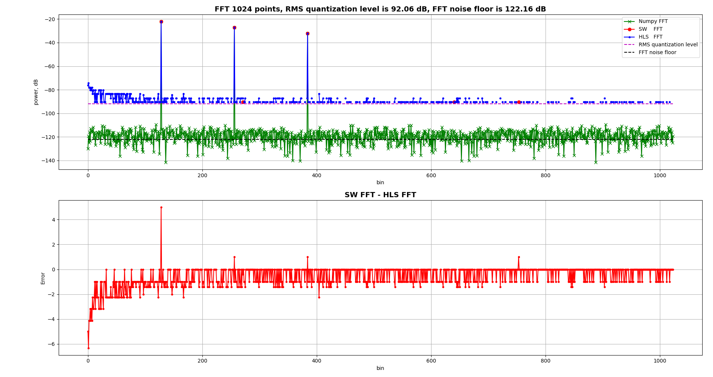
</p>

<div align="center">
<b>Figure 2.1 </b> Results of Numpy, Python and HLS FFT implementation
</div>
<br/> 
<p align="justify">
First plot is a power of FFT output implemented in Numpy (green), Python (red) and HLS Co-simulation (blue). Since Python and HLS implementation is scaled to 16-bit signed register, thir nois floor is restricted by Root Means Square (RMS) value, that depends on length of a register. In case of 16-bit signed register, minimum level of power spectrum can be 

$$SNR_{RMS} = 6.02 * 15 + 1.76 = 92.06 \  dB$$

<p align="justify">
FFT itself without scaling, expands power spectrum range 

$$SNR_{FFT} = 10*\log_{10}(Npoints)  \  dB$$
<p align="justify">
Noise floor reduction in FFT is caused by narrow-bandness  of FFT itself [2]. For demonstration the noise floor reduction, let's consider two noise 1024-points  signals with amplitude 0 dB and -20 dB in the following Python script


<details>

<summary><b>View code</b></summary>

```python
import numpy as np
import matplotlib.pyplot as plt

Npoints = 1024
SNR_1 = 0
SNR_2 = -20

n_1 = 10**(SNR_1/20)*np.random.randn(Npoints)
n_2 = 10**(SNR_2/20)*np.random.randn(Npoints)

# normalized Numpy FFT 
nf_1 = np.abs(np.fft.fft(n_1)/Npoints)
nf_2 = np.abs(np.fft.fft(n_2)/Npoints)

plt.figure()
plt.plot(20*np.log10(nf_1), '.-r', label='nf_1 SNR = 0 dB')
plt.plot(20*np.log10(nf_2), '.-b', label='nf_2 SNR = -20 dB')
plt.title("FFT {} points, FFT noise floor is {:3.2f} dB".format(Npoints, 10*np.log10(Npoints)), fontweight="bold", fontsize=14)
plt.legend(loc='upper right')
plt.grid()
plt.xlabel('bin')
plt.ylabel('power, dB')
plt.show()
```

</details>

<p align="center">
  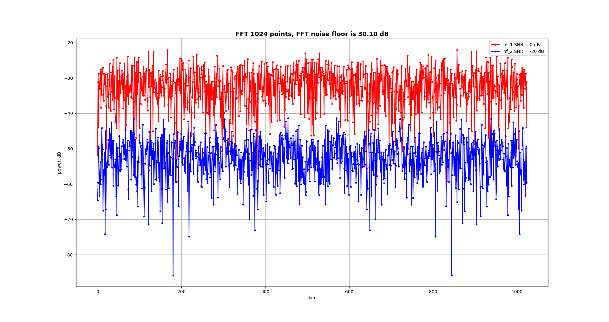
</p>

<div align="center">
<b>Figure 2.2 </b> FFT noise floor reduction
</div>
<br/> 
<p align="justify">
As can be seen from Fig. (2.2)  noise floor was moved on 30 dB since 1024-point FFT was applied (FFT noise floor is 30 dB).
<br>
<p align="justify">
Second plot in Fig. (2.1) is a result of comparison Python FFT implementation and HLS Co-simulation output. The small error is caused by rounding operation during FFT computation. 


## High Level Synthesis Implementation


<p align="justify">
Hardware Design is a key point before implementation.
Hardware design allows to figure out what kind of resourses (BRAM, DSP, LUTs)
and how many are required for an algorithm implementation, what optimization (area, latency, throughput) can be applied.
For example, FFT Hardware Design for $log_2N$ stages and <i>N</i> points is depicted on Fig. (3.1)

<p align="center">
  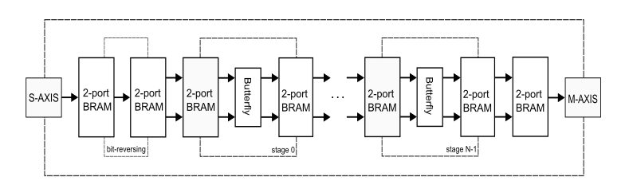
</p>

<div align="center">
<b>Figure 3.1 </b> FFT hardware design for HLS
</div>
<br/>

<p align="justify">
The Hardware Design includes pre-processing stage for bit-reversing and further stages for computation (<i>n_stage</i>). External interface is fully pipelined AXI STREAM. 
During pre-processing stage input data is stored according bit-reversed indexes into BRAM memory. 
Every stage for computation takes pair of data from 2-ports BRAM and does calculation. Final stage pushes data into AXI STREAM interface.
Throughput, area, latency of the Hardware Design (pipelining) is provided by applying some optimization HLS techniques (directives) [3].
<br/>

<i>Bit-reversing or pre-processing</i>
<br/>

<p align="justify">
Bit-reversing algorithm is implemented in pre-processing stage and does data reading from one memory and storing to another.

<details>

<summary><b>View code</b></summary>

```cpp
/**
 * Bit reversal operation
 *
 * @param 	Addr 		U-bits address for reversal
 * @return 	reversal 	address
 *
 */
template <typename T>
T revBits(T Addr)
{
#pragma HLS INLINE
	T revAddr = 0;
	rb_L:for(uint8_t idx = 0; idx < FFTRADIX; idx ++)
	{
		revAddr <<= 1;
		revAddr  |= Addr & 1;
		Addr    >>= 1;
	} // rb_L

	return revAddr;
} // revBits


/**
 * Pre-processing stage
 *
 * @param 	x 		input  data array
 * @return 	y 		output data array with bit-revesed indexes
 *
 */

template <typename T>
void reverse_stage(T x[NPOINTS], T y[NPOINTS])
{
	T 			temp = 0;
	uint16_t 	idx_r= 0;

	revst_L:for(uint16_t idx_d = 0; idx_d < NPOINTS; idx_d ++)
	{
		idx_r 	= revBits<uint16_t>(idx_d);
		y[idx_r]= x[idx_d];
	} // revst_L
} // reverse_stage

```

</details>

<p align="justify">
Here the directive <b>HLS INLINE for</b> <i>T revBits(T Addr)</i> function was applied. The directive removes the function as separate entity 
in the HLS hierarchy - in other words, the directive built the function into the <i>void reverse_stage(T x[NPOINTS], T y[NPOINTS])</i> and represents 
both functions as one entity. Two BRAM blocks are involved in the pre-processing stage as interfaces.

<br/>

<i>n-stage, butterfly implementation</i>
<br/>

<p align="justify">
The Butterfly implements 2-points decimation-in-time DFT algorithm. The algorithm uses complex multiplier, addition and substraction arithmetic operation.

<br/>

<details>

<summary><b>View code</b></summary>

```cpp
/**
 *  butterfly dit (decimation-in-time) implementation
 *
 *  @param x_0 point in complex value converted in word cmpx_t<int16_t> -> uint32_t
 *  @param y_0 point in complex value converted in word cmpx_t<int16_t> -> uint32_t
 *  @param w_0 coeff in complex value converted in word cmpx_t<int16_t> -> uint32_t
 *  @return x_1, y_1 points in complex value converted in word cmpx_t<int16_t> -> uint32_t
 *           ------             -----
 *  x_0---->| z^-2 |--+-----+->|  +  |------> x_1
 *           ------    \   /    -----
 *                      \ /
 *                       X
 *           ------    /  \     -----
 *  y_0---->| cmpx |--+----+-->|  -  |------> y_1
 *           -+----             -----
 *           /
 *  w_0---->
 *
 *   x_1 = x_0 - y_0 * w_0
 *   y_1 = x_0 + y_0 * w_0
 */
template <typename T, typename U, typename V, uint8_t F>
void butter_dit(T x0, T y0, T w0, T *x1, T *y1)
{
#pragma HLS INLINE
	cmpx_t<V>   x_0 = {0, 0}, y_0 = {0, 0}, w_0 = {0, 0};

	uint2cmpx.uint = x0;
	x_0 = uint2cmpx.cmpx;

	uint2cmpx.uint = y0;
	y_0 = uint2cmpx.cmpx;

	uint2cmpx.uint = w0;
	w_0 = uint2cmpx.cmpx;

	cmpx_t<V>  x_1 = {0, 0};
	cmpx_t<V>  y_1 = {0, 0};

	cmpx_t<U> cmpx_mlt = {0, 0};
	cmpx_mlt.re_  = sum_pair<V, U>(y_0) * (U)w_0.re_ - sum_pair<V, U>(w_0) * (U)y_0.im_;
	cmpx_mlt.im_  = sum_pair<V, U>(y_0) * (U)w_0.re_ + sub_pair<V, U>(w_0) * (U)y_0.re_;

	cmpx_t<V> scaled_mlt = scl_pair<V, U, F>(cmpx_mlt);

	cmpx_t<U> dout_0 = cnv_pair<U, V>(x_0) + cnv_pair<U, V>(scaled_mlt);
	cmpx_t<U> dout_1 = cnv_pair<U, V>(x_0) - cnv_pair<U, V>(scaled_mlt);

	x_1 = scl_pair<V, U, 1>(dout_0);
	y_1 = scl_pair<V, U, 1>(dout_1);

	*x1 = (T &) x_1;
	*y1 = (T &) y_1;
} // butter_dit
```

</details>


<p align="justify">
Resource utilization and timings can be seen from Performance & Resource Estimation Fig. 3.2
<br/>


<p align="center">
  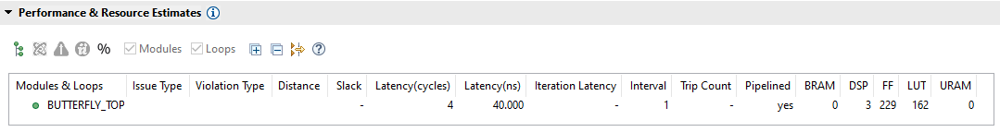
</p>

<div align="center">
<b>Figure 3.2 </b> Butterfly HLS Performance & Resource Estimation
</div>
<br/>


<p align="justify">
The algorithm's implementation is based on 3 DSP blocks, fully pipelined and has 4 clocks latency. In addition butterfly's output 
is scaled in order to avoid overflowing.
<br/>

<br/>

<i>n-stage implementation</i>
<br/>

<p align="justify">
Every stage involves input and output 2-ports BRAM interfaces and one butterfly entity. Two complex points are passed to butterfly's input 
with according coefficient and pushed out to the next BRAM.

<br/>

<details>

<summary><b>View code</b></summary>

```cpp
/**
 *
 * FFT stage (reading array + butterfly processing)
 *
 * @param x[] 	input array
 * @param w[] 	input coefficients
 * @param casc 	stage number
 *
 * @return y[] 	output array
 *
 */

template <typename T, typename U, typename V>
void n_stage(T x[NPOINTS], T y[NPOINTS], uint8_t casc)
{
#pragma HLS BIND_STORAGE variable=wcoe type=rom_np impl=lutram latency=1
	T x0 = 0, y0 = 0;
	T x1 = 0, y1 = 0;
	nstage_L:for(uint16_t idx = 0; idx < NPOINTS / 2; idx ++)
	{
#pragma HLS PIPELINE
		uint16_t  d 	 = ((idx % POW2(casc)) == 0)  ? 2*idx : d + 1;
		uint16_t _idx1   = d + 0;
		uint16_t _idx2   = d + POW2(casc);
		T w0 = wcoe[W_IDX(idx, casc)];

		x0 		 = x[_idx1];
		y0 		 = x[_idx2];
		butter_dit<T, U, V, 15>(x0, y0, w0, &x1, &y1);
		y[_idx1] = x1;
		y[_idx2] = y1;
	} // nstage_L
} // n_stage
```

</details>
<br/>

<p align="justify">
The implementation includes <b>HLS PIPELINE</b> directive, that provides ability to calculate 2-point DFT every clock. 
All coefficients are precomputed and stored into ROM memory, that is implemented by using LUT resources. 
This ROM implementation is required since fully pipelined FFT implementation (Several stages should work simultaneously). 
The directive <b>HLS BIND_STORAGE</b> is applied to the global variable <i>wcoe</i>.
<br/>

<p align="justify">
All stages are combined together in one common function

<br/>

<details>

<summary><b>View code</b></summary>

```cpp
/**
 *  FFT CORE
 *
 */
template <typename T, typename U, typename V, int TU, int TI, int TD>
void wrapped_fft_hw (stream<stream_1ch> &in_stream, stream<stream_1ch> &out_stream)
{
#pragma HLS DATAFLOW
	T	mem_bram[FFTRAD_1][NPOINTS];
#pragma HLS ARRAY_PARTITION variable=mem_bram dim=1
#pragma HLS BIND_STORAGE variable=mem_bram type=ram_t2p impl=bram
	T 	x[NPOINTS];
#pragma HLS BIND_STORAGE variable=x type=ram_t2p impl=bram


	pop_input  <T, TU, TI, TD, NPOINTS>( in_stream, x);
	reverse_stage<T>(x, mem_bram[0]);
	ffthw_L:for(uint8_t casc = 0; casc < FFTRADIX; casc ++)
#pragma HLS UNROLL
			n_stage    <T,U,V>(  mem_bram[casc], mem_bram[casc + 1], casc);

	push_output<T, TU, TI, TD, NPOINTS>(out_stream, mem_bram[FFTRADIX]);
} // wrapped_fft_hw
```

</details>

<br/>

<p align="justify">
There are several important directives for improving throughtput and reserving certan resources. For example, <b>HLS ARRAY_PARTITION</b> allows 
to divide 2 dimentional <i>mem_bram</i> array into several arrays or 2-ports BRAM blocks, <b>HLS UNROLL</b> is for unrolling <i>for</i> loop, 
since every FFT stage can be computed only in sequence, that's why pipelining here is not allowed. 
Directive <b>HLS DATAFLOW</b> plays significal role in order to provide pipelining on task-level and increasing the overall throughput (Fig. (3.2)). 
In other words, the directive arranges all stages for providing computation as soon as possible. For example, every stage can accept new data 
after the last two points were read out to butterfly.
<br/>

<p align="center">
  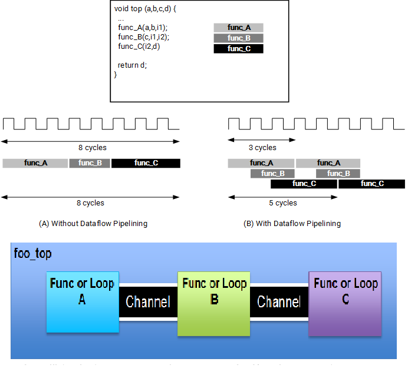
</p>

<div align="center">
<b>Figure 3.2 </b> Applying <b>HLS DATAFLOW</b> directive
</div>
<br/>

<p align="justify">
Task-level pipelining requires so-called <i>channels</i>, that could be implemented as Ping-Pong buffers or FIFO. It is additional memory resources.
Channels allow to align and buffer data between tasks thereby providing high task-level performance or throughput.

<br/>

<p align="justify">
HLS Summary for Synthesis and Cosimulation of 16-points FFT is given below. Hardware design consists of functions (Fig. 3.3):

1. <i>pop_input</i> for input data from AXI STREAM
2. <i>reverse_stage</i> for reversing input data
3. <i>n_stage</i> FFT stage with butterfly
4. <i>push_output</i> for output data to AXI STREAM


<br/>

<p align="center">
  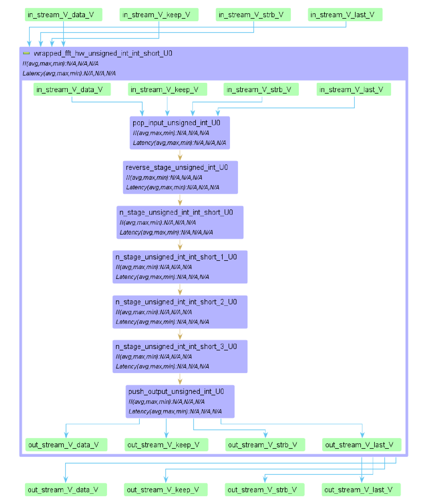
</p>

<div align="center">
<b>Figure 3.3 </b> 16-points FFT HLS dataflow
</div>
<br/>

<p align="justify">
There are $\log_2N$ or for 16 points 4 stages of FFT. All stages and functions are working sequentially. Because of  <b>HLS DATAFLOW</b> directive each function is ready to accept new 
data after processing of previous data is completed. Thus fully pipelined design is provided. Resource and timings estimation for the design is given on Fig. 3.4


<br/>

<p align="center">
  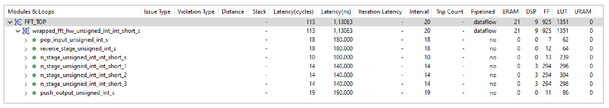
</p>

<div align="center">
<b>Figure 3.4 </b> 16-points FFT HLS synthesis report
</div>
<br/>


<p align="justify">
The Hardware Design utilizes 21 block BRAM and 9 DSP. BRAM utilization is caused by FFT stage implementation and <b>HLS DATAFLOW</b> directive (Fig. 3.5).
Each stage except first one (since multiplication is replaced by inversion) utilizes 3 DSP blocks for complex multiplication implementation. 

<br/>

<p align="center">
  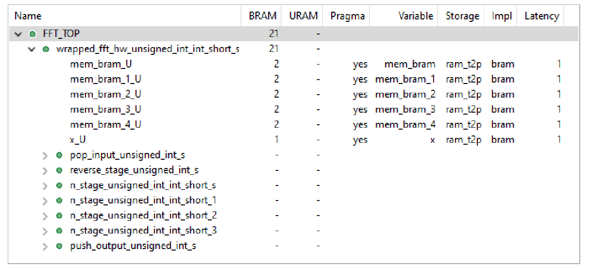
</p>

<div align="center">
<b>Figure 3.5 </b> 16-points FFT HLS BRAM Utilization
</div>
<br/>


<p align="justify">
BRAM blocks are implemented with a feature <i>ram_t2p</i> for using 2-ports with read / write capability on both.
Cosimulation report allows to estimate performance or timings (Fig. 3.6). 

<br/>

<p align="center">
  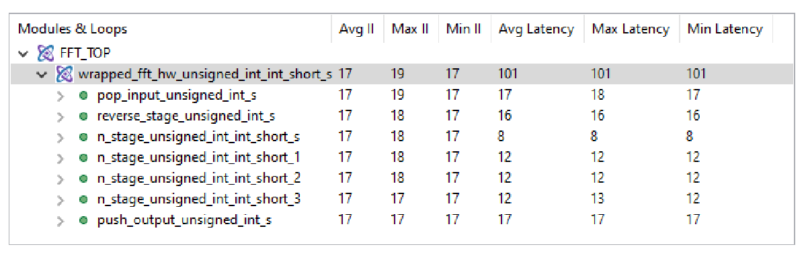
</p>

<div align="center">
<b>Figure 3.6 </b> 16-points FFT HLS cosimulation report 
</div>
<br/>


<p align="justify">
<i>Latency</i>  means when the last output will be provided after first input (101 clock cycles in our case). <i>Interval</i> timing shows when
the algorithm will be ready to accept a new data (17 cycles for all points). It means that after 16 words input there is a 1 cycle pause and then the algorithm is 
ready to accept a new sequence of 16 words.
Timings for each function of the Hardware Design can be found in Timeline Trace report (Fig. 3.7) 

<br/>

<p align="center">
  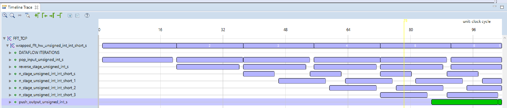
</p>

<div align="center">
<b>Figure 3.7 </b> Timeline Trace report 
</div>
<br/>


<p align="justify">
The Timeline Trace report shows performans of each function and the algorithm overall. 
As can be seen from Fig. 3.7 the last word of output will be provided after 101 clock cycles.   


## References

1. Alan V Oppenheim, Ronald W. Schafer, Discrete-Time Signal Processing, 3rd Edition, 2010
2. [W. Kester, Understand SINAD, ENOB, SNR, THD, THD + N, and SFDR so You Don't Get Lost in the Noise Floor, Analog Devices, 2008](https://www.analog.com/media/en/training-seminars/tutorials/MT-003.pdf)
3. [Vitis High-Level Synthesis User Guide UG1399](https://docs.xilinx.com/r/en-US/ug1399-vitis-hls/pragma-HLS-interface)